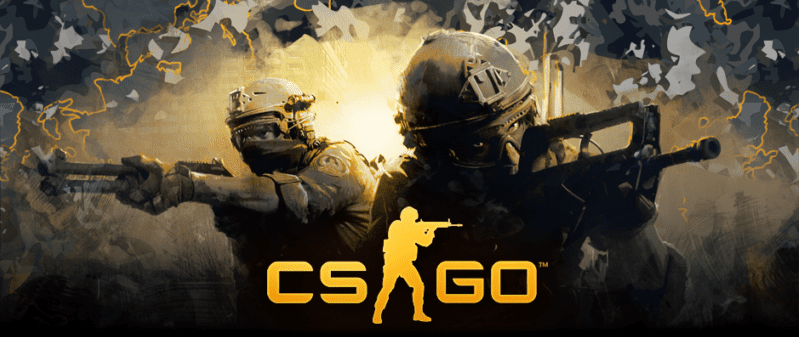

# CS:GO Grenade Usage Analysis

## Overview
This project analyzes the impact of grenade usage in Counter-Strike: Global Offensive (CS:GO) matches, focusing on the relationship between grenade damage and match outcomes/players rank across different maps.

## Key Findings

1. **Grenade Damage and Match Victory**
   - Statistical analysis with 90% confidence level shows that teams dealing more grenade damage tend to win matches.
   - The correlation varies significantly across different maps.
   - This relationship is not focused on causality analysis (Higher Damage > Wins or Wins > Higher Damage).

2. **Map-Specific Analysis**
   - Maps like de_overpass and de_cache show stronger correlation (~66.67%) between grenade damage and victory
   - Analysis includes heat maps of grenade landing positions for strategic insights

## Methodology
- Data analysis using Python (Pandas, Matplotlib, Seaborn)
- Statistical tests including:
  - Proportion comparison tests
  - Confidence interval analysis
  - Distribution analysis across different player rankings

## Data Features Analyzed
- Grenade landing coordinates (X, Y)
- Damage dealt (HP + Armor)
- Match outcomes
- Player rankings
- Map-specific statistics

## Requirements
- Python 3.10
- Pandas
- Matplotlib
- Seaborn
- SciPy

## Video Presentation
For a detailed walkthrough of the analysis and findings, check out our [presentation video](link_para_video_apresentaçao).
